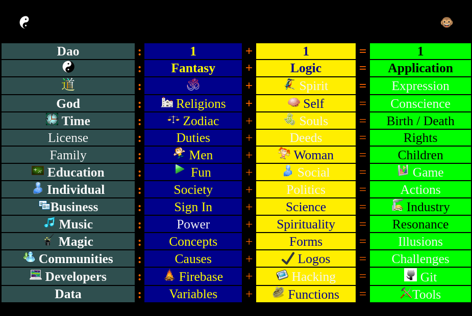
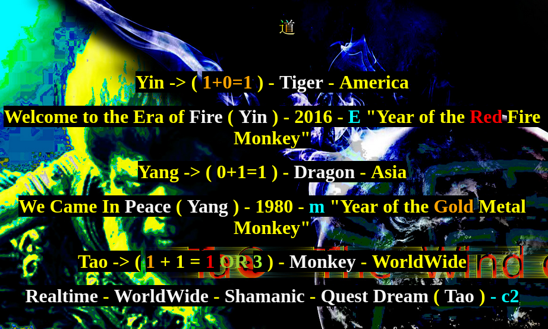

# Nothing in here

This repository was made as a concept proof of this idea:

- 1 + 1 = 1 OR 3

Everything works that way in Monkey Brain!

## Check:

```javascript
const source = 1;
if (source !== 0) {
	const fantasy = 1;
	const logic = 1;
	const application = 1;
	const expression = fantasy + logic + application;
	return expression;
}
```

<h2> Fantasy </h2>

OM: [Creative Artwork](https://art.odicforcesounds.com) + [MonkeyBooks](https://odicforcesounds.github.io/MonkeyBooks/)

<h2> Logic </h2>

Brain + Internet = Communication ( union point - Synchronized )

<h4>Computers</h4>

- 1: Concepts ( fantasy ) +
- 1: Language ( logic ) =
- 1: Application ( expression )

<h4> Brains </h4>

- 1: Educational Principles ( fantasy ) +
- 1: Educational Tools ( logic ) =
- 1: Educational Behaviors ( expression )

---

A Artistic Approach about what is / means the origins of this <b>SUPER</b> old theory // Dao Expression



---

In reference of E=mc2 ( Electricity - aka Real Time )


